# Reporte 2
   
## Introducción
El estudio de series de tiempo es un área interdisciplinar, una utilidad del estudio de modelos de series de tiempo es la posibilidad de predecir con cierta precisión algún fenómeno sin embargo, para poder estimar estos modelos de predicción, se parte del supuesto que la serie de tiempo no contiene datos faltantes, atípicos, o erróneos. Este reporte muestra una estructura de datos que puede ser de ayuda en la implementación de modelos de reconstrucción de series de tiempo.

## Algoritmos para facilitar la evaluación de modelos de reconstrucción
Una serie de tiempo son datos estadísticos reales que se registran en intervalos regulares de tiempo; bajo esta definición podemos definir una serie de tiempo como una tupla de vectores $V = (v_1,v_2)$, donde $v_1, v_2$ son vectores de $n$ elementos ordenados, con $v_1 \in \mathbb{R}$ y $v_2$ indicadores de un intervalo de tiempo definido.

Aprovechando estructuras definidas por el lenguaje de programación **Python** se construye una matriz de datos usada como base de la estructura. 

La matriz se construye con los vectores $v_1, v_2$ en forma columna y se agrega una columna que clasifica a cada dato en un grupo definido para su estudio.

| $v_1$ | $v_2$ | $S$ |
|-------|:-----:|:---:|
| $f_1$ | $x_1$ | $s_1$
| .| . | . |.|
| .| . | . |.|
| .| . | . |.|
| $f_n$ | $x_n$ | $s_n$|

La estructura contiene un conjunto de funciones que facilitar la visualización y reconstrucción de los datos.

**Visualización**

Para visualizar el contenido se usa el método **describe** que hace uso del método *hist*, la función logra mostrar un resumen de los datos de la matriz como la cantidad total de datos, la cantidad total de huecos y la distribución sobre el tamaño de los huecos. 

1. describe: Muestra un resumen de la cantidad de datos y huecos.
   1. hist: Regresa una lista de listas con la información de los pesos de los huecos (o datos según se use).
   
**Reconstrucción**

Para reconstruir los huecos del documento se construyeron diferentes métodos que permiten crear datos que permitan realizar pruebas estadísticas, nuevos huecos siguiendo una distribución definida o agregar columnas a los datos.

1. **añadirCol**: Agrega una columna a la matriz.
2. **vecS**: Agrega una columna a la matriz que representa la pertenencia a valor del conjunto S.
3. **contar**: Devuelve una matriz de datos que contiene la posición inicial y la cantidad de elementos del tipo hueco o dato.
4. **indices**: Devuelve una matriz de datos que contiene la posición inicial y la cantidad de elementos del tipo hueco o dato.
5. **generadorHuecos**: Agrega una columna de huecos (o datos) definida por una distribución.
6. **validaIndices**: Verifica que se cumpla una condición de existencia en función de una mascara.
7. **verificaDatos**: Verifica que se cumpla una condición de pertenencia a un elemento del conjunto S.

## Reconstrucción usando la estructura

La mejor forma de aprovechar la estructura es creando una función de reconstrucción que tome como entrada los parámetros *objeto* y *nombreCol* (además de los que el modelo de reconstrucción necesite). El primero representa a la estructura de datos y el segundo representa la columna en la que se almacenan los datos que se desean construir o visualizar.

Para ejemplificar el uso de la estructura se desarrollo una función **vecinosCercanos** que intenta reconstruir los datos faltantes de una serie de tiempo considerando el valor de los elementos circundantes a un punto y la métrica euclidiana.m

Para su implementación se utilizó unicamente métodos de la matriz y trabajando con las reglas del álgebra (la estructura puede ser trabajada con las reglas del álgebra vectorial).

Con los métodos de la estructura es fácil añadir los valores creados por la función en una nueva columna de datos.

## Particulares del problema de contaminantes PM 2.5

Usando la estructura de datos creada en **Python** junto con los métodos implementados, es fácil tener una visión general de la calidad de los datos y poder conocer datos como:

1. Tamaño del objeto
2. Relación entre datos existentes y faltantes.
3. Histograma de dispersión de datos y huecos.
4. Estadísticos como media, moda y mediana*

En nuestro caso de estudio es importante conocer cómo están distribuidos los huecos en los datos, por lo que la vista de un histograma es necesario. Para las primeras estaciones de la Ciudad de México (CDMX) se pudieron obtener las siguientes imágenes:

**Merced**

**Cuajimalpa**
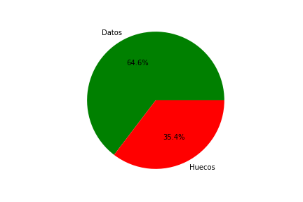
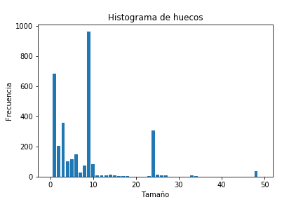
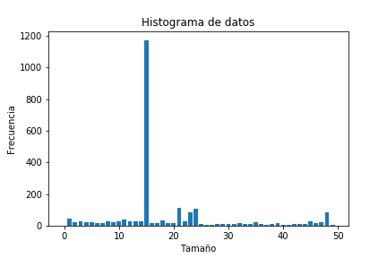

**FES Acatlán**
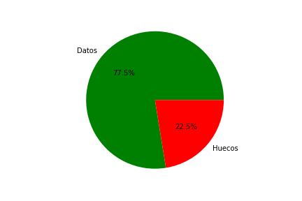
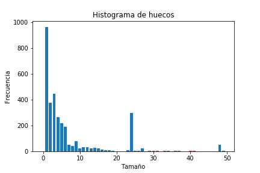
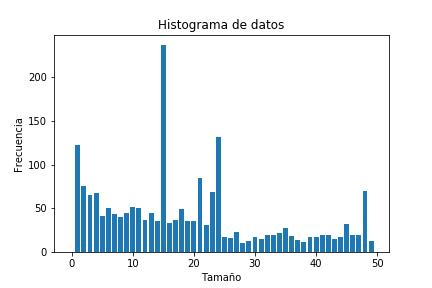

**Montecillo**
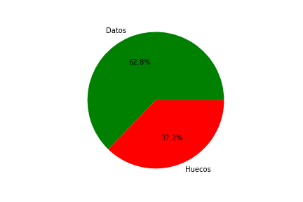
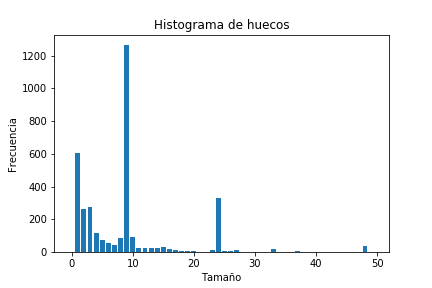
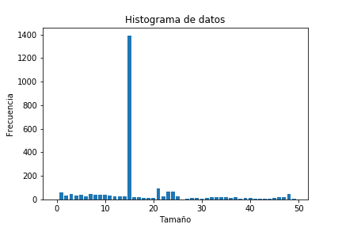

**Pedregal**
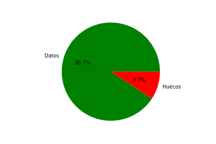
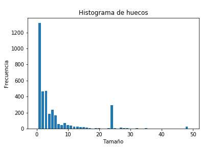
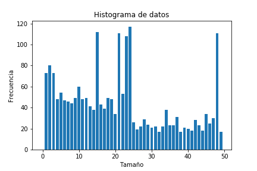

La esperanza en la visualización de las imágenes es que se acoplen, en cierta medida, a una distribución conocida, como $\xi²$ o alguna otra, y con ello tener una primera intuición estadística para realizar un método de reconstrucción, o bien, para generar nuevas fallas siguiendo la distribución no parámetrica que ofrecen los datos.
