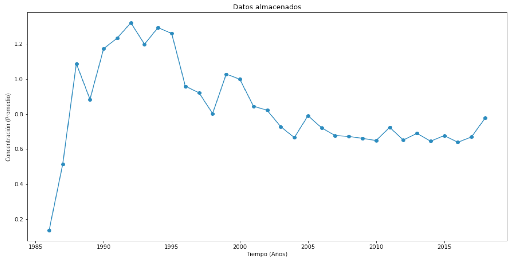

# Reporte 1

## Validación Cruzada para reconstrucción de series de tiempo

**Abstract:** El estudio de series de tiempo es un area interdisciplinar donde interactúan diferentes áreas (pero no se limita a estas) como estadística, ciencias de la computación, sistemas dinámicos y teoría de la información. El estudio de series de tiempo tienen aplicación diversa en arás como economía, ciencias de la tierra, química atmosférica, optimización de aprovechamiento de recursos naturales renovables y no renovables como agua y viento. La principal utilidad del estudio de modelos de series de tiempo es la posibilidad de predecir con cierta precisión a la vez que se minimiza la incertidumbre de los valores de ciertas variables. Sin embargo, para poder estimar estos modelos de predicción, en especial los modelos estadísticos de la familia Box-Jenkins y Exponential Smoothing, se parte del supuesto que la serie de tiempo no contiene datos faltantes, datos atípicos, o erróneos. Este reporte revisa modelos de validación cruzada para modelos de predicción, y basado en estos, la propuesta de validación cruzada para medir la capacidad de reconstrucción de algún modelo. 

### Series de tiempo (terminar).

*Definición de serie de tiempo*

*Para que sirve el estudio de series de tiempo?*

*Problemas técnicos con la generación de series de tiempo:  (Mencionar que la tecnología que produce series de tiempo no es infalible a fallas, limitando el modelado para la predicción a solo un subconjunto de datos. Una condición deseable es tener la maxima información disponible y de calidad para ajustar modelos de prediccion.)*

### Modelos populares (terminar Traducir y complementar).

*There are at least two widely used (and complementary) approaches:*

Existen al menos dos enfoques ampliamente utilizados para predicción, mencionamos algunos ejemplos:

*   Enfoque estadístico
    *    **Suavizado Exponencial** (Holt-Winters, 1960): La idea is utilizar promedio de sumas pesadas de observaciones en el pasado. Estos pesos son decresiente en el tiempo tan pronto las observaciones se van haciendo antiguas. Este enfoque puede capturar los patrones de estacinaridad y tendencia.
    *   **Los modelos autoregresivos de medias moviles ARIMA** (Box-Jenkins, 1974), Describe los patrones de la serie de tiempo utilizando las correlaciones temporales de la serie de tiempo, y los errores del pasado.
    *   ***BATS (**B**ox-Cox transformation, **A**RMA errors, **T**rend and **S**easonal Components))** Es un modelo que combina los modelos anteriores además de incluir ciertas transformaciones para estabilizar los datos. 2011 by A. M. de Livera R. J. Hyndman and R. D. Snyder.*

*   Computacionales
    *   **Redes neuronales.**: son funciones de regresión inspiradas en el comportamiento de las neuronas biológicas. Son modelos de neuronas artificiales que son capaces de capturar patrones muy complejos. Tienen aplicaciones en problemas de clasificación y regresión.
    *   **Vecinos cercanos** Es una técnica de clasificación y predicción el cual explota la evidencia empírica para resolver problemas de clasificación y regresión. Esta técnica es muy poderosa pero depende de la disponibiliad de gran cantidad de datos.
    *   **Redes Bayesianas o de creencia:** Son redes de relaciones probabilistas, la cual un dado vector de características de entrada, se calcula la probabilidad de que una variable dependiente presente un valor. Son grafos no dirigidos, donde los nodos representan un conjunto de variables aleatorias.

### Predicción (terminar basarse en la introducción del libro de Montgomery).

*Desde Página 1 de Montgomery et. al.*

*Nuestro modelo general de reconstrucción puede verse como una extensión del  propuesto en el libro de Montgomery Fig 1.12*

### Limitantes del proceso de predicción (terminar).

*Mencionar que funciona siempre y cuando la calidad de los datos sea buena (no datos atípicos, no datos faltantes, datos calibrados).*

### Modelo de reconstrucción se relaciona con el de predicción (terminar).

*Describir el proceso de reconstrucción y como se conecta con el proceso de predicción*

### Validación (terminar).

*Porque es importante validar el modelo?* 

*Como los datos se organizan en diferentes conjuntos: entrenamiento validacion y prueba, y para que?* (te pongo un ejemplo en esta sección)

[*ejemplo: Los modelos se entrenan con un conjunto de entrenamiento, y se mide su desempeño o capacidad de generalizacion con el conjunto de validación.*

*El conjunto de prueba se utiliza para que un tercero pruebe el modelo propuesto.* 

*Si la muestra de los datos son consitentes, entonces el error del modelo de prueba y validación deben ser parecidos.*]

#### Validación de modelos para datos independientes de contexto. (atemporales y no espaciales)(terminar)

**Validación cruzada *$k$-fold* **

[*(Modificar el ejemplo de validación de clasificación para convertirlo en un problema de predicción)*, usar referencia de wikipedia https://es.wikipedia.org/wiki/Validaci%C3%B3n_cruzada]

#### Validacion de modelos para predicción de datos temporales.(terminar)

*Leer la referncia https://robjhyndman.com/hyndsight/tscv/ y basado en eso escribir esta sección*

*Retomar la Propuesta de Hyndman. (Re-hacer la gráfica para no infringir derechos de autor, puede ser este ejemplo, y ademas simplificado, e.g., menos datos y unos cuantos renglones )*

#### Validación de modelos para reconstrucción de datos temporales (terminar).

*Descripción de la propuesta con palabras*

*Esta figura no existe, hay que elaborarla y es importante porque es lo que proponemos*

### Medidas del error para la evaluación del desempeño de modelos de predicción

La medición del error, consiste en determinar con alguna métrica que tan diferente es valor real $y_i$ comparado con un estimado  $\hat{y}_i$ generado por algún modelo de regresión. 

Los modelos de regresión son modelos generales los cuales incluyen los modelos de predicción, reconstrucción, clasificación entre otros.  

Para esto, existen varias medidas que pueden ser utilizadas para la evaluación de un modelo

 En este apartado se reportan algunas métricas populares utilizadas para medir el error de las regresiones tomadas de Douglas et al. que son calculadas a partir de los residuales

$$e_i=y_i-\hat{y}_i$$

Error promedio

$$EP = \frac{1}{n}\sum_{i=1}^n e_i$$.

Este error estima el valor esperado del error el cual tiene una esperanza estadística cero en caso que las estimaciones no estén sesgadas.

Desviación media absoluta 

$$DMA = \frac{1}{n}\sum_{i=1}^n|e_i|$$

Error Promedio de sumas al cuadrado.

$$PSC =  \frac{1}{n}\sum_{i=1}^{n} (e_i)^2$$

$DMA$ y $PSC$ son dos medidas que miden la variabilidad de los errores de regresión. Se busca que la variabilidad sea la menor.

Promedio de los porcentajes absolutos de error

$$MAPE = \frac{1}{n}\sum_{i=1}^n|\frac{y_t-\hat{y}_t}{y_t}|$$

Es una medida sin magnitud que mide la variabiliad relativa en porcentaje al valor real. El problema con esta métrica es que $y_t$ no puede ser cero ya que produce una indeterminación. Otra desventaja es que dependiendo del valor de denominador, la diferencia en el numerador se magnifica o reduce y esto a veces no es deseable.

### Propuesta del algoritmo general de reconstrucción (terminar).

*por ejemplo:*

1.  *Organizar serie de tiempo en conjuntos de entrenamiento, validación y prueba.*
2.  *generar fallas aleatorias a la serie de tiempo*
3.  *Reconstruir datos faltantes con un modelo de reconstrucción.*
4.  *Medir el error de reconstrucción*

*Describir de manera general como queremos diseñar el software, puede ser textual, diagrama de bloques, UML, las funciones o clases*

### Conclusiones

### Referencias

1. TISSBERT: Reconstruccion de series de tiempo https://polipapers.upv.es/index.php/raet/article/view/9749/10323
2. What to Do about Missing Values in Time-Series Cross-Section Data. (James Honaker The Pennsylvania State University Gary King Harvard University) 2010
3. E. Castaño: Time Series Data Reconstruction: An Application to the Hourly Demand of Electricity. https://www.researchgate.net/publication/262722662_Time_Series_Data_Reconstruction_An_Application_to_the_Hourly_Demand_of_Electricity
4. R. Hyndman. Cross-validation for time series https://robjhyndman.com/hyndsight/tscv/
5.  A. M. de Livera R. J. Hyndman and R. D. Snyder. BATS
6. D. Montomery. et al. Time Series Analysis and Forecasting. Second Edition.
7. [https://es.wikipedia.org/wiki/Validaci%C3%B3n_cruzada](https://es.wikipedia.org/wiki/Validación_cruzada)
