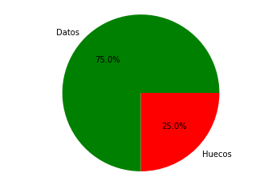
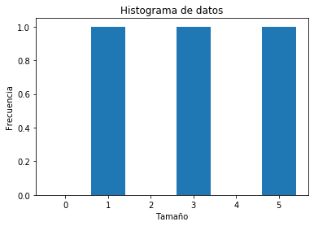
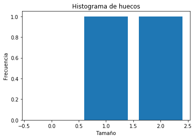
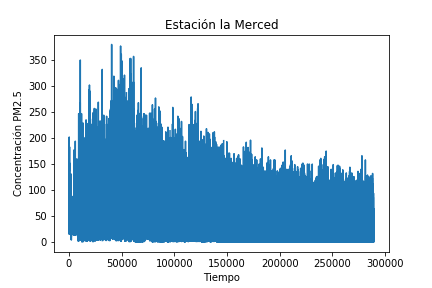
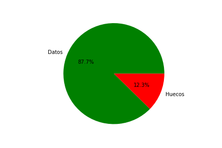
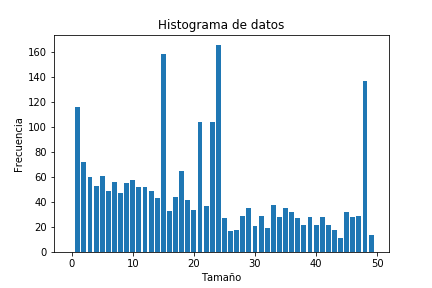
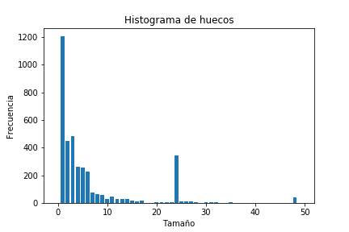

# Reporte 2


## Algoritmos para facilitar la evaluación de modelos de reconstrucción


Elaborado por Ariel Cerón González


En este reporte se describe como se utilizan la clase del módulo desarrollado el cual contiene una estructura de datos, y funciones que hacen uso de esta estructura para el análisis descriptivo de valores faltantes de series de tiempo, preparación y organización  de los datos para su posterior análisis de desempeño de algoritmos de reconstrucción. 

La estructura de datos consiste en una tabla, donde una medición de la serie de tiempo se encuentra en una fila en una determinada columna. Además, la tabla contiene una serie de columnas que guardan una serie de vectores con valores en el tiempo útiles para la evaluación de modelos de reconstrucción. 

Las columnas de esta tabla son:


date: Tiempo

$x_i$: Variable dependiente a estudiar.

$S$: conjunto de datos (entrenamiento, prueba o validación)

**_HGV#_**: Huecos generados artificialmente

**_R#h#m#t#_**: Reconstrucción

Para las columnas $HGV$ y $Rhmt$ se modifica los signos de gato por un número consecutivo en el caso de $HGV$ y por los parámetros de reconstrucción en el caso de $Rhmt$.


Para utilizar las funciones de visualización y reconstrucción (el cual incluye las funciones para la simulación de fallas) es necesario primero cargar los paquetes Pandas, datetime y el módulo desarrollado *cmpy2.py*.


```python
#Se importa la libreria pandas para observar el archivo de tiempo
#Libreria para manipular variables de tiempo
#Importación de la libreria desarrollada
#Libreria que permite crear series de datos con caos 
import numpy as np
import cmpy2 
```

Es necesario tener una lista de datos que será nuestra serie de tiempo. A manera de ejemplo construimos una serie de tiempo sintética de pocos datos que incluya valores nulos.

```python
#Lista de datos con valores nulos
data = [1,2,3,np.nan,np.nan,4,np.nan,5,6,7,8,9]
```

Después generamos un vector de fechas (date) del mismo tamaño que el vector de datos (data) los cuales se utilizaran como índices para acceder de maneara única a cada fila.


```python
# Lista de fechas
date = ['01/01/1986 01:00:00', '01/01/1986 02:00:00', '01/01/1986 03:00:00', '01/01/1986 04:00:00', '01/01/1986 05:00:00', '01/01/1986 06:00:00', '01/01/1986 07:00:00', '01/01/1986 08:00:00', '01/01/1986 09:00:00', '01/01/1986 10:00:00', '01/01/1986 11:00:00', '01/01/1986 12:00:00']
```


Generamos un vector de tres elementos los cuales indican que proporción de los valores vamos a designar a conjunto de entrenamiento, prueba y validación, siempre comprobando que la suma de los valores de uno.


```python
#Vector de clasificación v = [0.6,0.2,0.2], la suma debe ser uno.
clasificacion = [0.6,0.2,0.2]
```

 

 Una vez que tenemos los vectores requeridos procedemos a inicializar el objeto *cmpy2.py* usando la clase Reconstrucción

```python
#Creación del objeto se alimenta con el vector de datos, el vector de fechas y el vector de clasificación (opcional)
prueba = cmpy2.Reconstruir(data,date,clasificacion)
>>>Datos agregados
>>>Datos agregados
>>>Datos agregados
>>>Datos importados
```

Podemos verificar la tabla construida con prueba.df

```python
prueba.df
```

La cual tendra la siguiente información

```
                    date	x_i    	S
0	1986-01-01 01:00:00	1.0	E
1	1986-01-01 02:00:00	2.0	E
2	1986-01-01 03:00:00	3.0	E
3	1986-01-01 04:00:00	NaN	E
4	1986-01-01 05:00:00	NaN	E
5	1986-01-01 06:00:00	4.0	E
6	1986-01-01 07:00:00	NaN	E
7	1986-01-01 08:00:00	5.0	E
8	1986-01-01 09:00:00	6.0	P
9	1986-01-01 10:00:00	7.0	P
10	1986-01-01 11:00:00	8.0	P
11	1986-01-01 12:00:00	9.0	V
```


Para poder visualizar los datos como la proporción y distribución de los datos faltantes se utiliza la método describe().

```python
prueba.describe()
```









El método describe arroja a la pantalla una descripción superficial de los datos, indicando la cantidad total de datos, la cantidad de datos de tipo numérico y la cantidad de datos que no son de tipo numérico (datos nulos), además de presentar tres gráficos.

* El primer gráfico nos indica la proporción en general de datos faltantes con respecto al total de datos.

* El segundo gráfico es un histograma que describe el número de secuencias de algún tamaño sin datos faltantes. Por ejemplo, hay una secuencia de tamaño 1, una secuencia de tamaño 3 y una de tamaño 5 de datos.

* El tercer gráfico es un histograma que describe la frecuencia con la que aparece secuencias de datos faltantes de algún tamaño. La manera de leer los datos es igual a la segunda gráfica.

Es importante señalar que describe genera dos tablas, la tabla de secuencia datos faltantes (huecos) y secuencia de datos no faltantes.

Aunque la naturaleza de los datos puede implicar una inexistencia de patrones, la visualización de estas tablas busca intenta identificar de forma gráfica alguna distribución conocida como $\xi^2$ o binomial; así como obtener parámetros que permitan replicar la distribución de los huecos, para ello es posible utilizar el método ```hist``` la cual nos produce (y devuelve) un histograma tal como se muestra enseguida.

```python
n, bins = prueba.hist('x_i','h')
print("Posición: ",n)
print("Peso:", bins)

>>>Posición:  [0, 1, 2]
>>>Peso: [0, 1, 1]
```


## Funciones de Reconstrucción

Para probar los algoritmos de reconstrucción es necesario tener datos con los cuales poder comparar.  Por lo tanto, una estrategia es simular datos faltantes en la serie de tiempo los cuales deben ser reconstruidos y al final comparar la reconstrucción (o estimación) de algún algoritmo con el la medición real.

Para simular datos faltantes en la serie de tiempo, se utiliza una columna especial para no alterar los datos originales. El generador de datos faltantes funciona con distribuciones de probabilidad. Estas pueden ser teóricas o empíricas. Por ejemplo para generar una secuencia aleatoria de número primero necesitamos definir histogramas de frecuencias de aparición de secuencias de algún tamaño ya sea de datos faltantes o datos no faltantes.  

```python
# Frecuencia de tamaño de secuencia de datos faltantes
denH = [1,3,5,7,42,1]

# Frecuencia de tamaño de secuencia de datos faltantes
denD = [4,2,1,4,1,2]
```

El generador de datos faltantes se encarga de convertirlos en una función de distribución de probabilidad cada uno, simular los datos faltantes y agregarlos en una nueva columna. La columna creada toma el nombre **HGV#**, donde # es sustituido por un número consecutivo variando en función de la posición de la columna que tome.

```python
#Nueva columna
nuevaCol = prueba.generadorHuecos(denH,denD)
```

Al aplicar el método de **generadorHuecos()** se agrega una nueva columna como se refleja en el resultado de abajo.


```
		date	 	x_i	S	HGV3
0	1986-01-01 01:00:00	1.0	E	1.0
1	1986-01-01 02:00:00	2.0	E	1.0
2	1986-01-01 03:00:00	3.0	E	1.0
3	1986-01-01 04:00:00	NaN	E	1.0
4	1986-01-01 05:00:00	NaN	E	NaN
```

Una vez que se tiene esta tabla, es posible utilizarla para probar algún algoritmo de reconstrucción.

## Particularidades de la serie de tiempo de PM 2.5

En esta sección se aplica la clase desarrollada para describir la calidad de la serie de tiempo de acuerdo a sus datos faltantes. 

La Ciudad de México facilita las series de de PM 2.5 capturadas en diferentes puntos de la zona metropolitana. Los datos son registrados cada 60 minutos,  desde el 1 de enero de 1986. hasta el 30 de Diciembre del 2018 . Esta serie de tiempo es típica de los sistemas de monitoreo los cuales no están libres de errores o fallas técnicas.

Se tomó la estación de la Merced para usar el objeto de Reconstruccion. 

Los datos desordenados se pueden observar los datos con un plot de la libreria **matplotlib**



Los datos de la estación están almacenados en un documento csv, se extraen los datos y se con ello se construye el objeto desarrollado.

```Python
import pandas as pd
df = pd.read_csv("fCDMX.csv")
fechas = df.date
datos = df.MER
ObjMer = cmpy.Reconstruir(fechas,datos,'Merced')
>>>Datos agregados
>>>Datos agregados
>>>Datos agregados
>>>Datos importados
```

Usando el método **describe** observamos la integridad de los datos y los histogramas descritos arriba.










En las gráficos podemos observar una carencia de datos equivalente a más de 12\% del total de los datos y en el caso del histograma de los huecos se puede observar cómo existe una cantidad mayor de huecos de tamaño uno y a partir de ello, hay una disminución en la cantidad de huecos de tamaño mayor a 1.

