# Reporte 3


## Uso de la estructura de datos para reconstruir una serie de tiempo


Elaborado por Ariel Cerón González


Modelos como ARIMA (Autoregressive Integrated Moving Average) parten del supuesto de que las series de tiempo que se van a evaluar no contienen datos faltantes, ni datos atípicos; sin embargo en la práctica estos problemas pueden ocurrir simultáneamente.

En este reporte se describirá cómo se puede utilizar la estructura de datos desarrollada a lo largo del servicio social para aplicar algoritmos de reconstrucción (como vecinos cercanos, redes neuronales o cualquier otro que necesite una estructura) de series de tiempo y visualizar de forma efectiva los resultados obtenidos.

## Algoritmo de reconstrucción

Para ejemplificar lo anterior se desarrollo un algoritmo basado en vecinos cercanos, el cual evalúa la diferencia entre los valores que circundan a un punto y los valores registrados a lo largo del tiempo. La diferencia es usada tomando una norma en los reales, para nuestro caso se uso la norma usual o la euclidiana.

En las siguientes lineas se intentará describir el algoritmo empleado:

**Entradas:** *cmpy*, *métrica*, *nombreCol*, S, *h*, *m*, tau, k

1: mascara = creaMascara(h,m,tau)
2: datos = cmpy.datos
3: huecos = cmpy.nombreCol
4: n = cmpy.len
5: distancias = SortedList()

6: indicesHuecos = cmpy.contar(huecos,'h')

7: for hueco in indicesHuecos
8:	for indice in {0,1,...,n}
9:			if indice != hueco
10:				v1 = datos[indice-mascara:indice+mascara+h]
11:				if v != nan
12:					v2 = datos[hueco-mascara:hueco+mascara+h]
13:					aux = v1*v2
14:					if aux != nan
15:						distancias.add([f(v1,v2),indice])

16:	if distancia != empy
17:		for indice in {0,1,..,k}
18:			vaux += distancias[indice]
19:		vaux = vaux/k

20:	 vector reconstruido = [vaux, hueco]

**Salidas:** *vector reconstruido*

Para el funcionamiento del algoritmo se necesita a la entrada el objeto cmpy (que es el componente principal y corazón del servicio), una función que funge como norma; ya que el objeto permite crear datos extra (se puede agregar diferentes columnas al objeto) se necesita saber el nombre de la columna sobre la cual considerara la posición de los huecos; *h, m, tau* son parámetros que definen el comportamiento de la función: h es el tamaño del hueco que se busca recontruir, m define la cantidad de elementos que compondrán al vector y tau define la periodicidad con la cual se elige un elemento.

Las primeras seis lineas son usadas para definir variables y que el flujo del código sea más entendible, en resumen se necesitan las siguientes variables:

* datos: Los datos originales de la serie de tiempo
* indicesHuecos: La posición de los huecos de tamaño *h*
* mascara: La mascara es un vector de ceros y unos que se contruye usando los parámetros *h, m, tau*. (Cabe aclarar que la mascara es un vector construido de la siguiente forma [m:h:m], teniendo una distancia 2m + h)

Las demás variables son auxiliares en el proceso.

Para iniciar el proceso de reconstrucción se recorre por todos los indices obtenidos en la linea 6; se recorre también por cada elemento del conjunto de datos iniciand m elementos después del primer punto y terminando m + h elementos antes del último punto.

Los ciclos iniciados nos permiten caminar entre los datos y con ello poder evaluar las diferencias entre el vector que contiene al hueco (v1) y todos los vectores que se puedan obtener de las datos de la serie de tiempo (v2), sin embargo para que un vector v2 pueda ser considerado debera pasar las siguientes condiciones que en el código se observan con condicionales if:

* El indice del hueco debe ser diferente al indice del vector de datos
* Los datos deben pertenecer según el conjunto*entrenamiento, prueba o validación* elegido
* El vector v2 en las posiciones donde la mascara tenga valor 1 deben ser diferente de *nan*.
* El vector v2 en la posición del hueco debe tener datos.

Si se cumplen todas las condiciones, se evalua la diferencia entre el vector v1 y el vector v2 y se almacena en una lista ordenada de forma acendente en función de las diferencias.

Por último se promedian los *k* elementos más cercanos, el valor obtenido se asigna al hueco analizado.

Estre procedimiento se repite en cada iteración hasta haber rellenado todos los huecos de tamaño *h*.

El proceso de reconstrucción de datos se realizó en dos partes, en la primera se tomo un conjunto de datos artificiales y en la segunda parte se trabajo con la serie de tiempo de contaminantes $PM2.5$ de la ciudad de México.

## 1. Datos artificiales

###  *Importando las librerias*

```python
#Se importa la libreria pandas para observar el archivo de tiempo
#Libreria para manipular variables de tiempo
#Importación de la libreria desarrollada
#Libreria que permite crear series de datos con caos 
import pandas as pd  
import numpy as np
import cmpy2 
from lorenz import *

```
### *Creando los datos*

```python
n = 50
datos = generateLorenz(n).tolist()
fechas = ['01/01/1986 01:00:00' for i in range(n)]
```

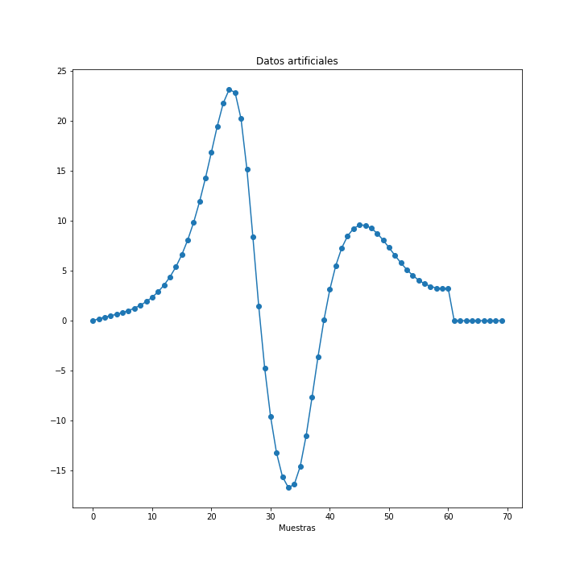

### Generando huecos

Como se muestra en la figura, no existe hueco alguno en los datos generados, por lo que se procede a generar huecos de forma artificial usando funciones aleatorias.

```python
prueba = Reconstruir(datos,fechas,"Prueba")
huecos = [random.randint(1,5) for _ in range(20)]
datos = [random.randint(1,100) for _ in range(14)]
prueba.generadorHuecos(huecos,datos)
```
Al generar huecos de forma artificial podemos visualizar la distribución de los datos en un histograma y la relación en una gráfica de pastel, ambas obtenidas al usar el método *describe* del objeto *prueba* 

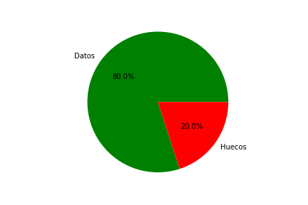

Para esta prueba se han generado huecos en el intervalo $[0,5]$, sin embargo eso no implica que no pueda aumentar el tamaño del intervalo elegido.

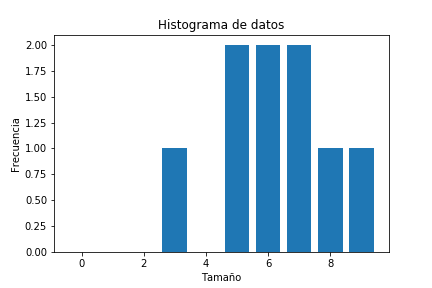
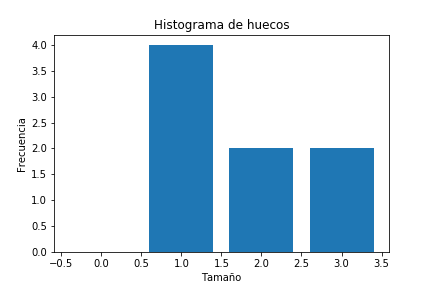

Los huecos generados de forma aleatoria se pueden observar de diferente color en la figura de abajo

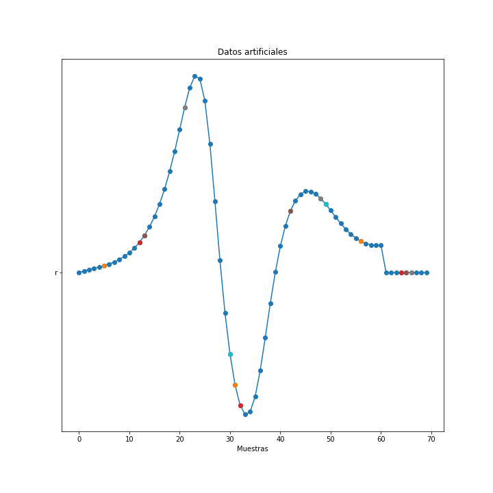

### Reconstruyendo huecos de tamaño 1

```python
h = m = tau = k = 1
rec = cmpy.distancias(prueba,metricaEu,'HGV3','E',h,m,tau,k)
```

Error absoluto: 3.32

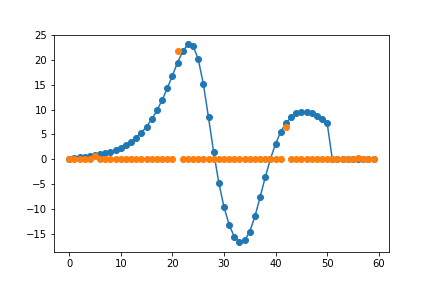

```python
h = k = 1
m = tau = 2
rec = cmpy.distancias(prueba,metricaEu,'HGV3','E',h,m,tau,k)
```

Error absoluto: 5.18

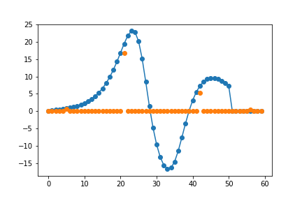

### Reconstruyendo huecos de tamaño 2

```python
h = 2
m = tau = k = 1
rec = cmpy.distancias(prueba,metricaEu,'HGV3','E',h,m,tau,k)
```

Error absoluto: 3.36

​							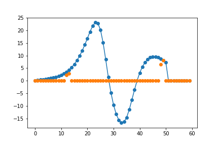

```python
h = m = tau = 2
k = 1
rec = cmpy.distancias(prueba,metricaEu,'HGV3','E',h,m,tau,k)
```

Error absoluto: 5.76

​						

### Reconstruyendo huecos de tamaño 3

```python
h = 3
m = tau = k = 1
rec = cmpy.distancias(prueba,metricaEu,'HGV3','E',h,m,tau,k)
```

Error absoluto: 9.82

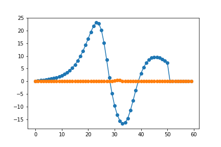

```python
h = 3
m = tau = k = 1
rec = cmpy.distancias(prueba,metricaEu,'HGV3','E',h,m,tau,k)
```

Error absoluto: 18.07

​						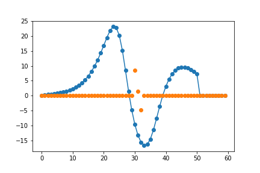

El trabajar con un conjunto pequeño de datos puede tener ventajas en el tiempo de ejecución y en la correción de errores de ejcución, sin embargo el código está pensado para trabajar con conjuntos grandes de datos, por lo que se realizó un segundo ejercicio con datos artificiales modificando la cantidad de datos a trabajar

```python
n = 10000
datos = generateLorenz(n).tolist()
fechas = ['01/01/1986 01:00:00' for i in range(n)]
```

La visualización de estos datos se plantea dificil por la densidad de puntos que se tiene; abajo se muestra el total de puntos obtenidos y un pequeño subconjunto de 400 muestras para observar mejor su comportamiento

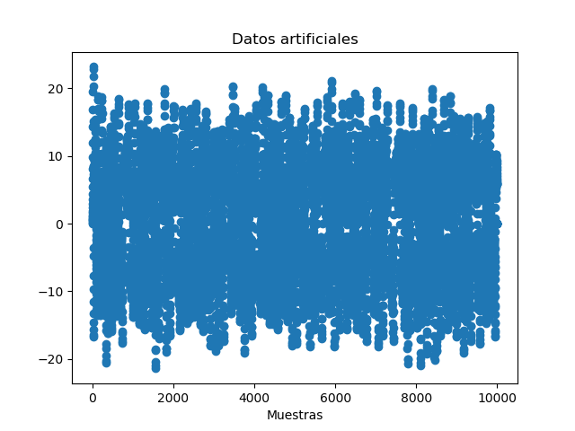

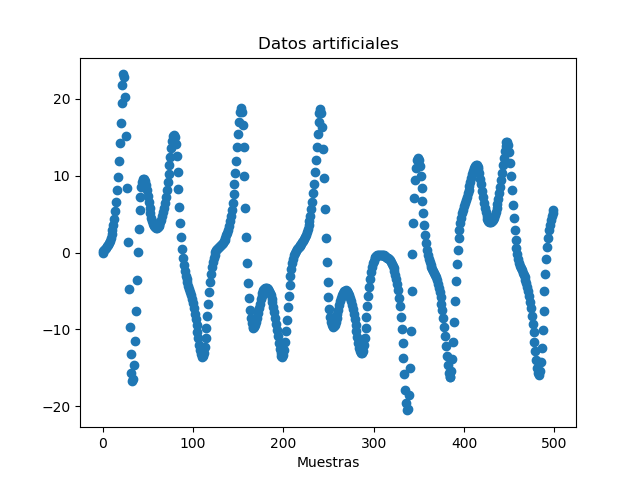

De igual forma que con el primer experimento, estos datos no muestran de forma natural huecos en su construcción por lo que también se generan huecos de forma aleatoria, mostrando la relación de huecos y datos en las siguientes figuras

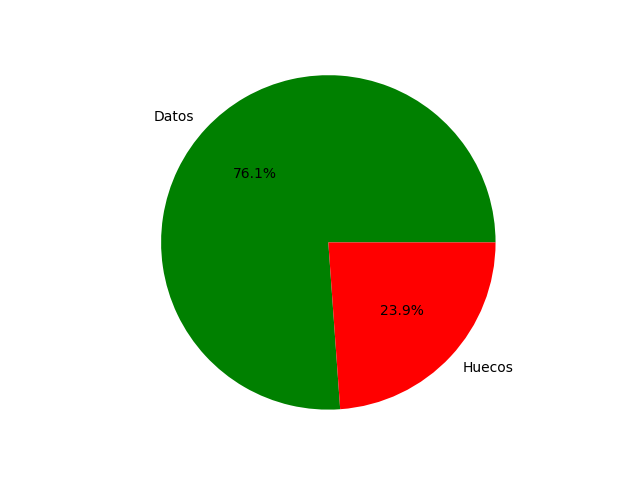

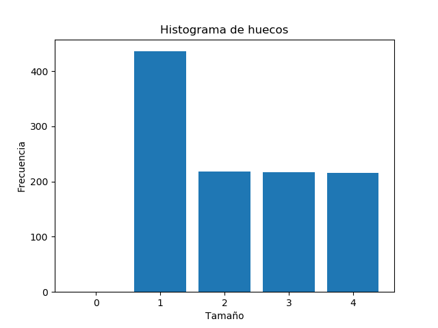

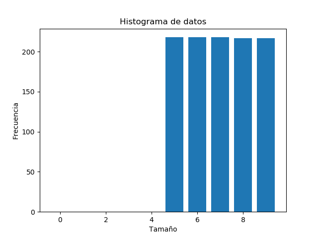

De forma ventajosa se volvió a utilizar un intervalo en huecos pequeño.

### Reconstruyendo huecos de tamaño 1

```python
h = 1
m = 3
tau = k = 1
rec = cmpy.distancias(prueba,metricaEu,'HGV3','E',h,m,tau,k)
```

Error absoluto: 0.1088

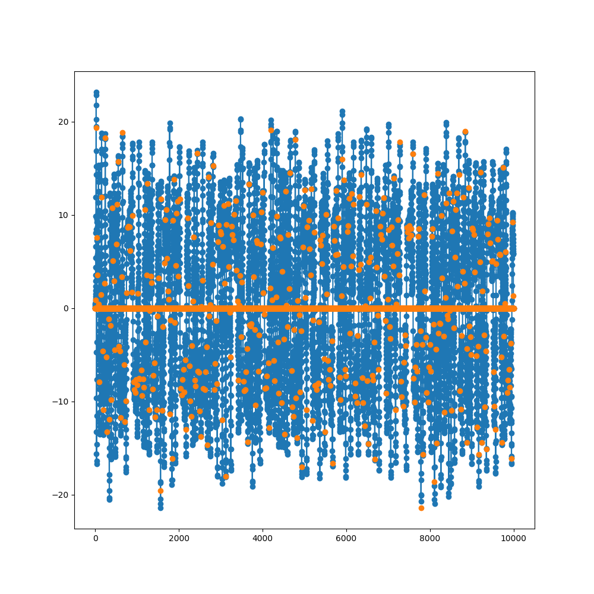

```python
h = 1
m = 4
tau = 2
k = 1
rec = cmpy.distancias(prueba,metricaEu,'HGV3','E',h,m,tau,k)
```

Error absoluto = 0.10


### Reconstruyendo huecos de tamaño 2

```python
h = 1
m = 3
tau = 2
k = 1
rec = cmpy.distancias(prueba,metricaEu,'HGV3','E',h,m,tau,k)
```

Error absoluto: 0.152

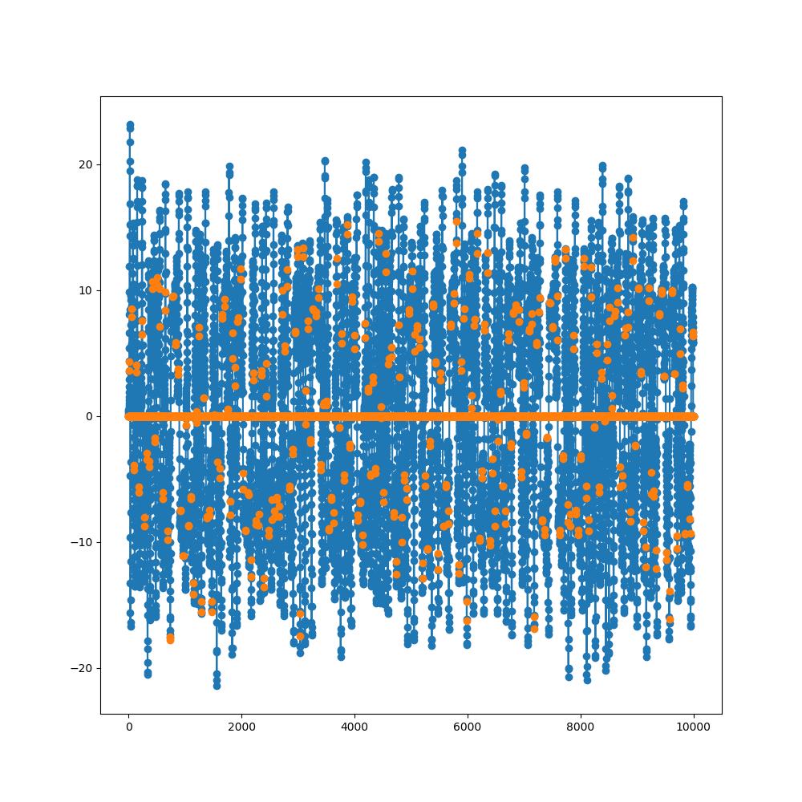

```python
h = 1
m = 2
tau = 1
k = 1
rec = cmpy.distancias(prueba,metricaEu,'HGV3','E',h,m,tau,k)
```

Error absoluto = 0.157


### Reconstrucción de huecos tamaño 3

```python
h = 3
m = 2
tau = 1
k = 1
rec = cmpy.distancias(prueba,metricaEu,'HGV3','E',h,m,tau,k)
```

Error absoluto: 0.157

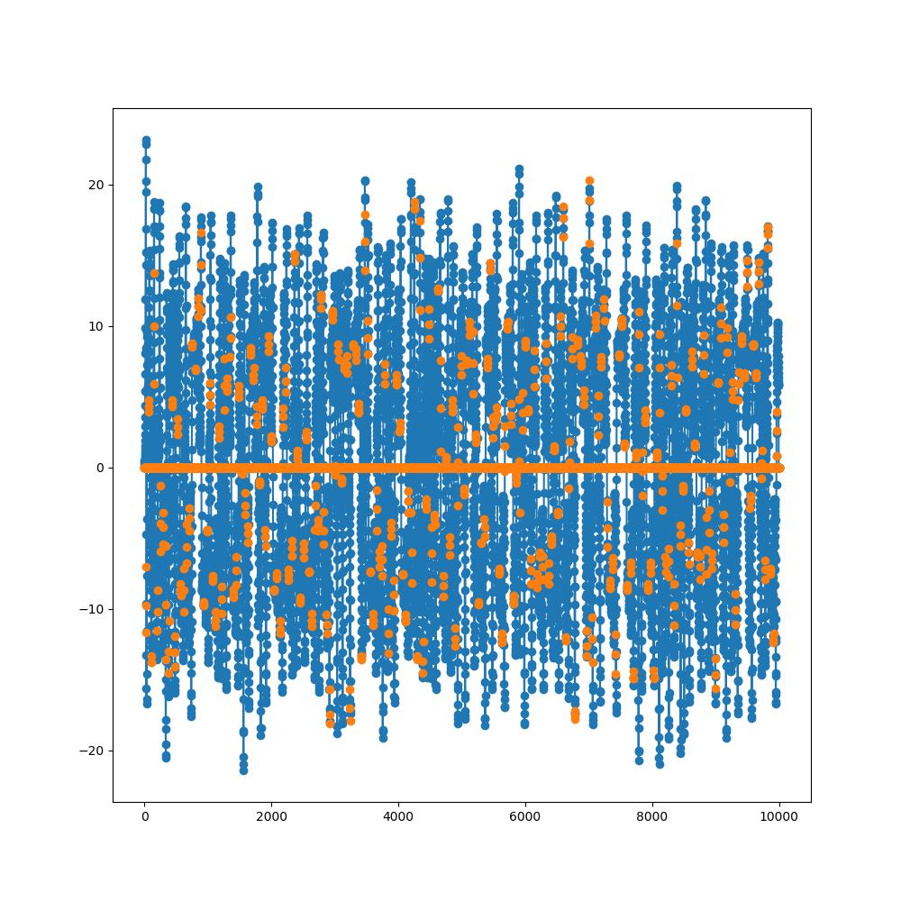

```python
h = 3
m = 3
tau = 2
k = 1
rec = cmpy.distancias(prueba,metricaEu,'HGV3','E',h,m,tau,k)
```

Error absoluto: 0.157


### Reconstrucción de huecos tamaño 4

```python
h = 4
m = 3
tau = 1
k = 1
rec = cmpy.distancias(prueba,metricaEu,'HGV3','E',h,m,tau,k)
```

Error absoluto: 0.20

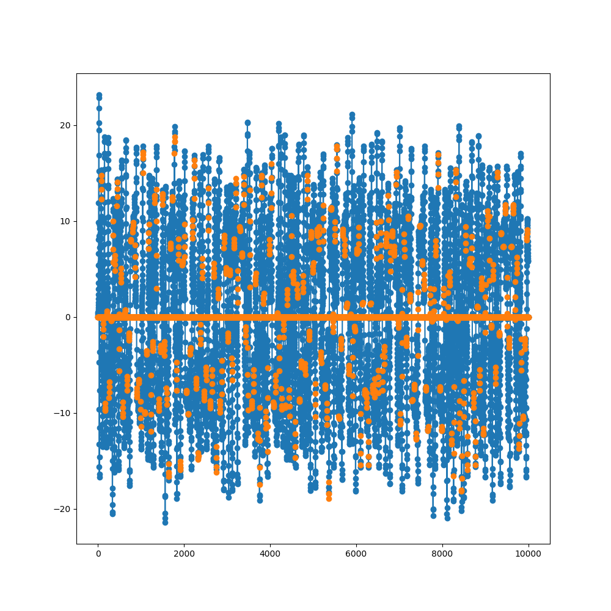

```python
h = 4
m = 4
tau = 2
k = 1
rec = cmpy.distancias(prueba,metricaEu,'HGV3','E',h,m,tau,k)
```

Error absoluto: 0.203


Al observar de forma rápida las imágenes podemos apreciar que todos los puntos de reconstrucción (naranja) quedan definidos dentro del dominio de los datos (azul) y se presenta un error pequeño a comparación del primer experimento con cincuenta datos.

También podemos observar el cambio en la calidad de reconstrucción (en función del error) al modificar los parámetros *m, k ,tau*.

Los últimos experimentos serán desarrollados haciendo uso de datos reales y modificando además, la cantidad de vecinos *k* considerados.

## 2. Datos reales

Como se ha comentado en reportes anteriores, se tiene una base de datos del nivel de ozono en la atmósfera de la Ciudad de México; para este ejemplo trabajaremos con los datos de la estación ubicada en la Merced (MER); usando las mismas librerias que ya fueron importadas en lineas arriba, procedemos a leer y extraer los datos.

```python
db = pd.read_csv("fCDMX.csv")
datos = db.MER.tolist()
fechas = db.date.tolist()
_MER = cmpy.Reconstruir(datos, fechas, 'MER')
```

Existe un registro inicial en 1986 y en total, hay 289 271 datos almacenados.

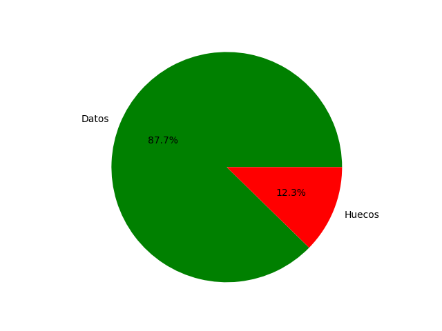

En la figura anterior podemos ver la relación de datos y huecos existente; en una simple inspección nos damos cuenta que la base de datos contiene una baja cantidad de huecos (en relación a los datos), sin embargo como se dijo en la introducción, lo deseable es tener una base de datos sin huecos.

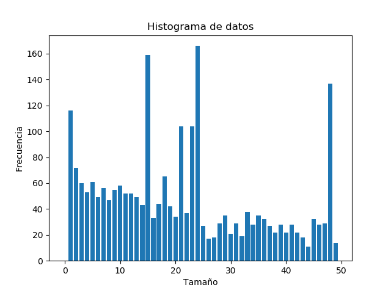

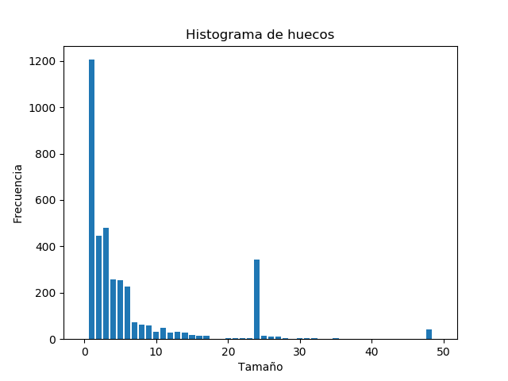

Por otro lado, existe una mayor cantidad de huecos tamaño uno que de otro tamaño.

Siguiendo un procedimiento parecido al realizado en las pruebas, se procede a reconstruir la serie de tiempo.

Habrá que recalcar que por limitaciones computacionales, no se trabajará con todos los datos adquiridos.

```python
n = 10000
h = 1
m = 2
tau = 2
k = 1
rec = cmpy.Reconstruir(_MER[:-n],metricaEu, 'x_i',h,m,tau,k)
```

Error absoluto: 0


```python
n = 10000
h = 1
m = 4
tau = 2
k = 1
rec = cmpy.Reconstruir(_MER[:-n],metricaEu, 'x_i',h,m,tau,k)
```


```python
n = 10000
h = 1
m = 5
tau = 4
k = 1
rec = cmpy.Reconstruir(_MER[:-n],metricaEu, 'x_i',h,m,tau,k)
```


```python
n = 10000
h = 2
m = 3
tau = 3
k = 1
rec = cmpy.Reconstruir(_MER[:-n],metricaEu, 'x_i',h,m,tau,k)
```


```python
n = 10000
h = 2
m = 1
tau = 1
k = 1
rec = cmpy.Reconstruir(_MER[:-n],metricaEu, 'x_i',h,m,tau,k)
```


```python
n = 10000
h = 3
m = 3
tau = 2
k = 1
rec = cmpy.Reconstruir(_MER[:-n],metricaEu, 'x_i',h,m,tau,k)
```


```python
n = 10000
h = 3
m = 5
tau = 3
k = 1
rec = cmpy.Reconstruir(_MER[:-n],metricaEu, 'x_i',h,m,tau,k)
```

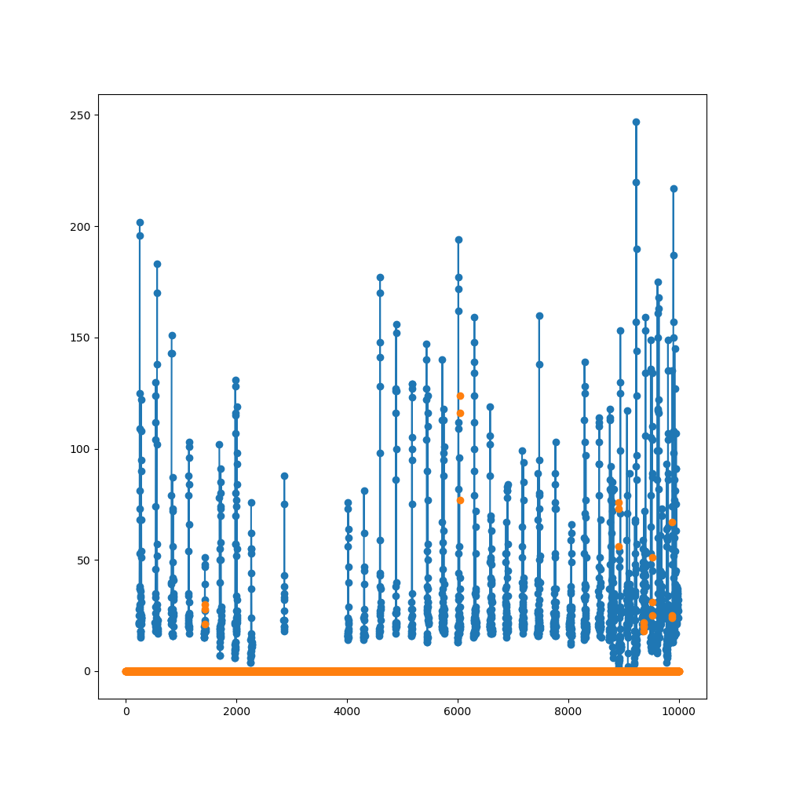

```python
n = 10000
h = 4
m = 1
tau = 1
k = 1
rec = cmpy.Reconstruir(_MER[:-n],metricaEu, 'x_i',h,m,tau,k)
```


```python
n = 10000
h = 4
m = 3
tau = 1
k = 1
rec = cmpy.Reconstruir(_MER[:-n],metricaEu, 'x_i',h,m,tau,k)
```

Abajo se presentan los mismos resultados para cantidades más grandes de datos:


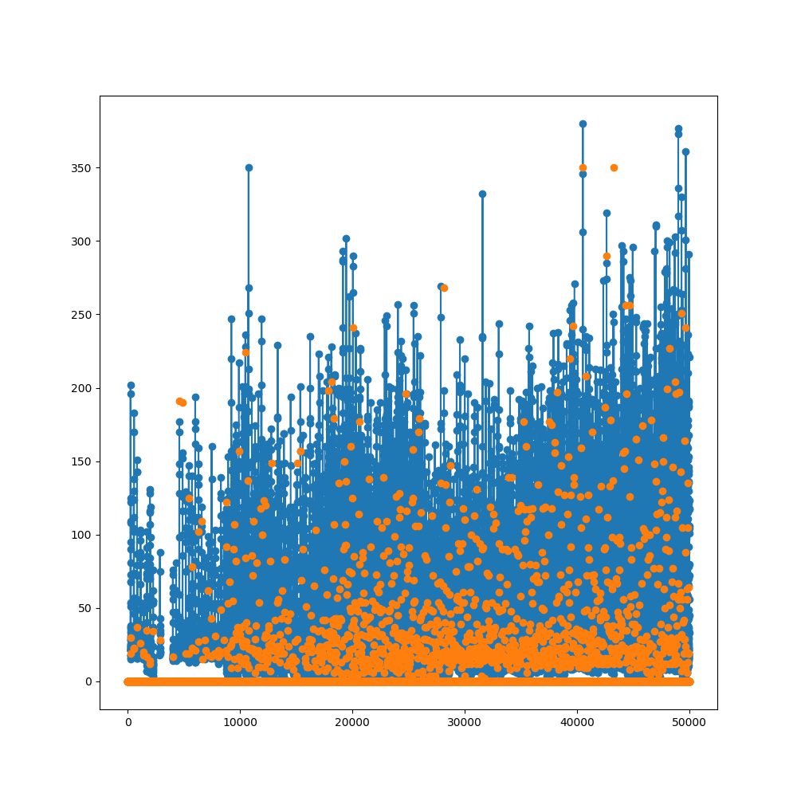

Datos: m1, tau1, k1


Datos: m1, tau2, k1

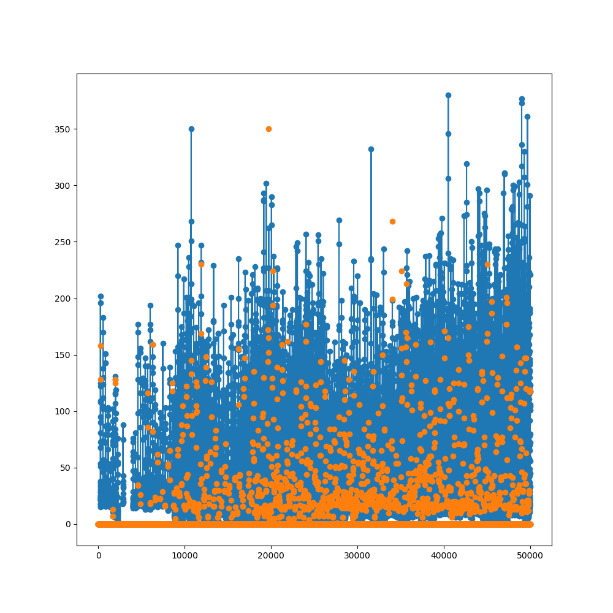

Datos: m2, tau1, k1


Datos: m3,tau2,k1

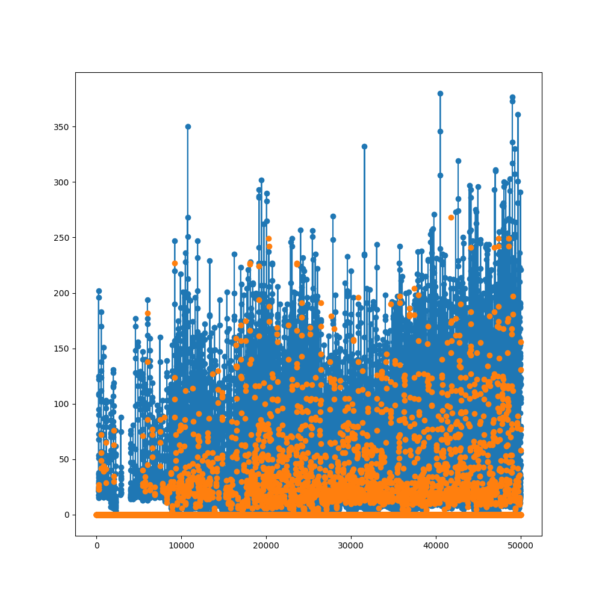

Datos : m3, tau4, k1


Datos: m1, tau2, k1


Datos: m1, tau2, k1

